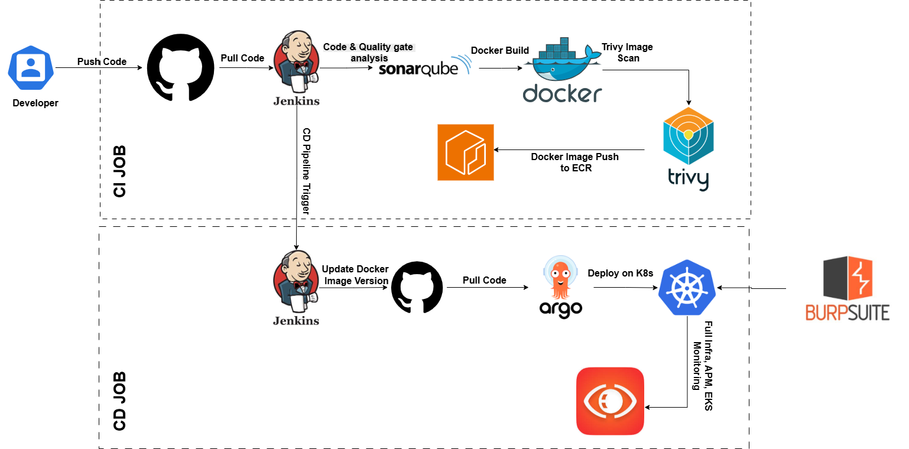

# Google Drive Clone

A full-stack Google Drive clone with separate frontend and backend servers.

## Architecture



## Features

- 🔐 User authentication (register/login)
- 📁 File upload/download/delete with drag & drop
- 📂 Folder management and navigation
- 🔗 File sharing with other users
- 💾 Storage tracking with visual progress bar
- 🔍 Search functionality
- 📊 Grid and List view modes
- 🎨 Google Drive-inspired UI
- 📱 Responsive design
- 🗂️ File type icons and previews

## Tech Stack

**Backend:**
- Node.js + Express
- MongoDB
- JWT authentication
- Multer for file uploads

**Frontend:**
- React
- React Router
- Axios

## Setup Instructions

### Backend Setup

1. Navigate to backend directory:
```bash
cd backend
```

2. Install dependencies:
```bash
npm install
```

3. Create `.env` file:
```
PORT=5000
MONGODB_URI=mongodb://localhost:27017/drive-clone
JWT_SECRET=your_secret_key_here
FRONTEND_URL=http://localhost:3000
```

4. Start MongoDB (make sure MongoDB is installed and running)

5. Start backend server:
```bash
npm start
```

Backend will run on http://localhost:5000

### Frontend Setup

1. Navigate to frontend directory:
```bash
cd frontend
```

2. Install dependencies:
```bash
npm install
```

3. Create `.env` file:
```
REACT_APP_API_URL=http://localhost:5000/api
```

4. Start frontend server:
```bash
npm start
```

Frontend will run on http://localhost:3000

## Docker Setup (Recommended)

Run the entire application with Docker Compose:

```bash
docker-compose up --build
```

This will start:
- MongoDB on port 27017
- Backend on port 5000
- Frontend on port 3000

To stop:
```bash
docker-compose down
```

To stop and remove volumes:
```bash
docker-compose down -v
```

## Deployment

### Kubernetes Deployment
See [k8s/README.md](./k8s/README.md) for complete Kubernetes deployment guide with:
- CI/CD Pipeline setup
- SigNoz observability integration
- Auto-scaling configuration
- Production best practices

### AWS EC2 Deployment
See [aws/README.md](./aws/README.md) for AWS deployment guide with:
- Separate EC2 instances setup
- Auto Scaling Groups (ASG) configuration
- Load Balancer setup
- Security group configuration

### Docker Compose (Local Development)
See [docker-compose.yml](./docker-compose.yml) for local development setup.

### Backend Deployment
- Deploy to services like Heroku, AWS EC2, DigitalOcean, or Railway
- Set environment variables on the hosting platform
- Ensure MongoDB is accessible (use MongoDB Atlas for cloud database)

### Frontend Deployment
- Build the frontend: `npm run build`
- Deploy to services like Vercel, Netlify, or AWS S3
- Update REACT_APP_API_URL to point to your deployed backend

## API Endpoints

### Auth
- POST `/api/auth/register` - Register new user
- POST `/api/auth/login` - Login user
- GET `/api/auth/profile` - Get user profile

### Files
- POST `/api/files/upload` - Upload file
- GET `/api/files` - Get all files
- GET `/api/files/:id/download` - Download file
- DELETE `/api/files/:id` - Delete file
- POST `/api/files/:id/share` - Share file
- GET `/api/files/shared` - Get shared files

### Folders
- POST `/api/folders` - Create folder
- GET `/api/folders` - Get all folders
- DELETE `/api/folders/:id` - Delete folder
